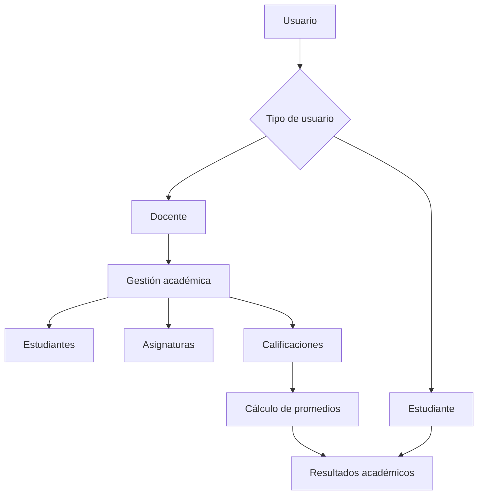
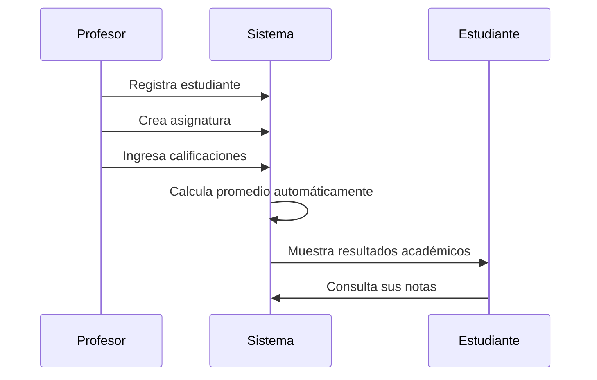

# 🎓 Notas Escolares

<div align="center">

## 📚 Plataforma de Gestión Académica

**Organiza, administra y consulta el rendimiento académico de estudiantes desde un solo lugar.**


</div>

---

## 🌟 Sobre el proyecto

**Notas Escolares** es un sistema de gestión académica desarrollado en **Python**, creado con el propósito de mejorar la manera en que los docentes registran, organizan y consultan las calificaciones de sus estudiantes.

El proyecto busca reemplazar los métodos tradicionales de registro manual, como cuadernos o archivos desorganizados, ofreciendo una solución digital que permita administrar información académica de manera rápida, ordenada y confiable.

La plataforma permite que los docentes gestionen estudiantes, asignaturas y calificaciones, mientras que los estudiantes pueden consultar su rendimiento académico sin modificar la información registrada.

---

# 🎯 Propósito del proyecto

En muchos entornos educativos, el registro de notas todavía depende de procesos manuales que pueden generar:

- ❌ Errores al calcular promedios.
- ❌ Pérdida de información.
- ❌ Dificultad para hacer seguimiento al rendimiento.
- ❌ Falta de comunicación entre docentes y estudiantes.
- ❌ Mayor tiempo invertido en tareas administrativas.

**Notas Escolares** nace como una alternativa digital que permite centralizar la información académica y facilitar la toma de decisiones.

---

# 💡 Solución propuesta

La plataforma proporciona un espacio donde:

👨‍🏫 Los docentes pueden:

- Registrar estudiantes.
- Crear asignaturas.
- Ingresar calificaciones.
- Actualizar información académica.
- Consultar promedios.
- Detectar estudiantes con bajo rendimiento.

👨‍🎓 Los estudiantes pueden:

- Consultar sus calificaciones.
- Revisar su promedio.
- Ver su progreso académico.
- Conocer su estado actual.

El estudiante tiene permisos únicamente de consulta, garantizando que la información sea segura y confiable.

---

# ✨ Características principales

## 👨‍🏫 Gestión docente

El sistema permite a los profesores administrar la información académica:

✅ Registro de estudiantes.

✅ Creación y gestión de asignaturas.

✅ Registro de diferentes tipos de evaluaciones:

- Talleres.
- Tareas.
- Exámenes.
- Proyectos.
- Actividades académicas.

✅ Ingreso de calificaciones.

✅ Cálculo automático de promedios.

✅ Seguimiento del rendimiento académico.

---

## 👨‍🎓 Consulta estudiantil

Los estudiantes cuentan con acceso personalizado para consultar:

📌 Notas por asignatura.

📌 Promedio general.

📌 Estado académico.

📌 Historial de calificaciones.

📌 Progreso durante el periodo académico.

> Los estudiantes pueden visualizar información, pero no tienen permisos para modificar datos.

---

# 👥 Roles del sistema

## 👨‍🏫 Docente

El docente es el usuario principal encargado de administrar el contenido académico.

### Permisos:

| Acción | Disponible |
|---|---|
| Registrar estudiantes | ✅ |
| Crear asignaturas | ✅ |
| Registrar notas | ✅ |
| Modificar notas | ✅ |
| Consultar promedios | ✅ |
| Ver estudiantes en riesgo | ✅ |
| Eliminar registros | ✅ |

---

## 👨‍🎓 Estudiante

Usuario encargado de consultar su información académica.

### Permisos:

| Acción | Disponible |
|---|---|
| Ver notas | ✅ |
| Consultar promedio | ✅ |
| Revisar asignaturas | ✅ |
| Modificar notas | ❌ |
| Eliminar información | ❌ |

---

## 👨‍💼 Administrador *(futura implementación)*

Rol encargado de la administración general del sistema.

Posibles funciones:

- Gestión de usuarios.
- Control de permisos.
- Administración de docentes.
- Supervisión del sistema.

---

# 🏗️ Arquitectura general del sistema



---

# 🔄 Flujo principal



---

# 📌 Objetivos

## Objetivo general

Desarrollar una plataforma digital que facilite la gestión, almacenamiento y consulta de información académica, permitiendo mejorar el seguimiento del rendimiento estudiantil.

---

## Objetivos específicos

- Digitalizar el proceso de registro de notas.
- Reducir errores en cálculos académicos.
- Facilitar el seguimiento del desempeño estudiantil.
- Mejorar la organización de información.
- Crear una comunicación más eficiente entre docentes y estudiantes.

---

# ⚙️ Tecnologías utilizadas

## Lenguaje principal

🐍 **Python**

Utilizado para desarrollar la lógica principal del sistema.

---

## Tecnologías complementarias

| Tecnología | Uso |
|---|---|
| Python | Desarrollo del sistema |
| HTML | Estructura visual |
| CSS | Diseño e interfaz |
| Git | Control de versiones |
| GitHub | Trabajo colaborativo |

---

# 📂 Estructura del proyecto

Ejemplo de organización:

```
Notas-Escolares/

│
├── app/
│   │
│   ├── models/
│   │   └── estudiantes.py
│   │
│   ├── services/
│   │   └── calculos.py
│   │
│   ├── controllers/
│   │   └── usuarios.py
│   │
│   └── main.py
│
├── frontend/
│   ├── index.html
│   └── styles.css
│
├── database/
│
├── README.md
│
└── requirements.txt
```

---

**Continúa en la PARTE 2/4...**

Integrantes:
- Cathalina Murcia
- Liseth Reyes

Docente:
- Henry Ortegon
